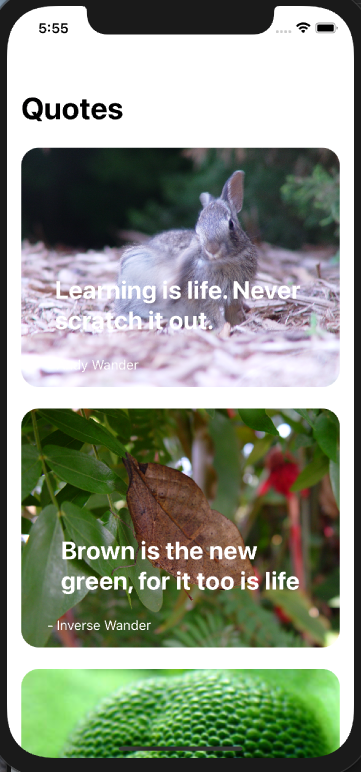
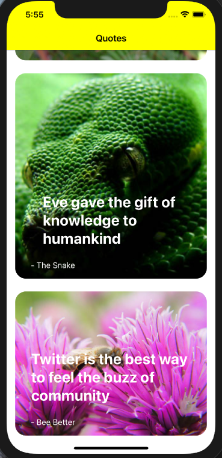
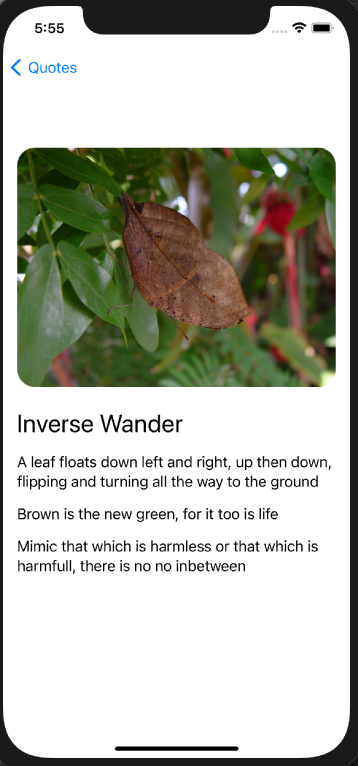

# 100 days Code with Chris

This is my journal and experience with [Code with Chris](https://codecrew.codewithchris.com/).  Bear in mind I have had about a year of me exploring swift using UIKit on and off.  I am switching over to swiftUI and decided to do a review from the beginning.

# Day 1

## Background

My coding experience comes from scripting in bash/unix and a little in python (~10 years) but no OOP.  Lot of the work I do involves learning how to run open source software to explore data and visualize it.

I have been on my iOS development learning journey since November of 2019.   Most of that journey was using @twostraws Hacking with Swift free series.  His stuff has been great but there are pieces in the material that seem to be missing like how to structure a project, how to connect multiple view controllers; how to pass/store variables between view controllers.   

To learn some of those aspects, I have scoured the web and have been working on several App ideas as learning projects.  I am no where near ready to publish anything.  How to publish is also missing in a lot of the free content out there.  When the spring sale came up, I checked it out and really liked the idea of having community and covering some of the topics missing from the free tutorials online.  

## Current problem

I have been playing with a photoApp idea I have and have been struggling with zoom and pan.  I found a really cool extension for UIimageView that I have expanded but haven't gotten it to work.  I plan on revisiting the scrollview method for doing this.  Why isn't zoom/pan a standard library?

I will post more on this with code as I explore it.  Right now I am just getting familiar with this forum and deciding where I want to start with @Chris2's tutorials.

# Day 1 continued...

* Mar 23, 2021
* 14 Day Beginner Challenge

Decided to start with the Beginner challenge.  My initial foray into swift was using UIKit as swiftUI was still fairly new a year ago and most of the tutorials and solutions you can find online were for UIKit and old versions of swift.  So I am exploring the Beginner's challenge to learn swiftUI fundamentals.

#### Lesson's 1 and 2
The first few lessons are about Apple development and Xcode, which I was mostly already familiar with.

#### Lesson 3

The third lesson is a remake of the classic "Hello, world" coding problem.  What I found really interesting here is the `command` click of a method to show the swiftUI inspector.  If you are new to swift you will not realize just how powerful a feature this is!  To be able to look at all of the possible ways you can modify the object in a fairly organized manner.  This is a huge advancement over UIKit coding where you are basically at the whim of the apple documentation.

I am anticipating that how you organize your methods will be really important for readability.

Consider making the following


* This is much harder to read

```
            Text("Hello, World").padding().background(Color.green).padding().background(Color.yellow)
```
Than
* This is
```
            Text("Hello, World")
                .padding()
                    .background(Color.green)
                .padding()
                    .background(Color.yellow)
```

I will be interested to see what @Chris2 recommends to code formatting in later tutorials.

# Day 2

* Lesson 4 and challenge
* Mar 24, 2021

As I expected, Chris2 does say to make new lines for the modifiers in the project.  I mentioned before that this is my first exposure to SwiftUI and I find this method of

```
modifier.modifier.modier
```

To be very similar to Unix command line where we pipe commands from one thing to the next.

`ls -lha | awk '{print $NF}' | xargs -I xx echo xx`

I will have to see how well that analogy holds up but if it does then I am going to really enjoy coding in swiftUI.

## Notes from Lesson 4

I have decided to use this forum to take notes as I progress.  I will avoid posting any answers to challenges but will include the modifiers I found useful from the lesson.   I made the challenge much more complicated because I didn't take notes from the lesson and didn't use what he taught. :(

### Objects

* Text("text")
* Image("name")

As of now we can only call images that are in the assets folder of the project, at some point I will want to know how to display it from the phone or the photo's library.

### Stacks

This is how we are organizing content in swiftUI,  Stacks have parameters that can be used to specify alignment and other properties (I haven't looked them up yet), for now I just want to remember that those properties may be easier to accomplish a look than a modifier.

| Stack | Description|
| -- | -- |
|VStack| Vertical stack of Objects|
|HStack | Horizontal Stack of Objects|
|ZStack| Perpendicular Stack of Objects |


### Modifiers

These can be applied to Objects or Stacks.

| Modifier | Description| Other |
| -- | -- | -- |
|.resizable()|Allow resizing| |
|.aspectRatio()|Keep Width and Height Fixed |.fit |
|.cornerRadius()|Modify object corners| |
|.font()| Modify the font size/type| .caption, .largeTitle|
|.padding()| White space around object|.trailing, leading, .top, .bottom|
|.opacity()|Make an object more see through |
|.background()| Can change the color of the background| |
| .foregroundColor()| Change the color of the foreground text/object| |
|.scaleEffect()| You can increase or decrease the size of the Object|
|.frame() | Add a frame around an object| |

FYI: the last two were modifiers I found trying to complete the challenge the hard way. :)


#### Colors
You can probably just name any color after the `Color.` and use it.  There will likely also be a way to include Hex colors. Wonder if I could extend Color to allow that.  That might be fun.

```
Color.white
```

So far so good. On to Lesson 5


# Day 2

* Lesson 4 and challenge
* Mar 24, 2021

As I expected, @Chris2 does say to make new lines for the modifiers in the project.  I mentioned before that this is my first exposure to SwiftUI and I find this method of

modifier.modifier.modier`

To be very similar to Unix command line where we pipe commands from one thing to the next.

```
ls -lha | awk '{print $NF}' | xargs -I xx echo xx
```  

I will have to see how well that analogy holds up but if it does then I am going to really enjoy coding in swiftUI.

## Notes from Lesson 4

I have decided to use this forum to take notes as I progress.  I will avoid posting any answers to challenges but will include the modifiers I found useful from the lesson.   I made the challenge much more complicated because I didn't take notes from the lesson and didn't use what he taught. :(

### Objects

* Text("text")
* Image("name")

As of now we can only call images that are in the assets folder of the project, at some point I will want to know how to display it from the phone or the photo's library.

### Stacks

This is how we are organizing content in swiftUI,  Stacks have parameters that can be used to specify alignment and other properties (I haven't looked them up yet), for now I just want to remember that those properties may be easier to accomplish a look than a modifier.

| Stack | Description|
| -- | -- |
|VStack| Vertical stack of Objects|
|HStack | Horizontal Stack of Objects|
|ZStack| Perpendicular Stack of Objects |


### Modifiers

These can be applied to Objects or Stacks.

| Modifier | Description| Other |
| -- | -- | -- |
|.resizable()|Allow resizing| |
|.aspectRatio()|Keep Width and Height Fixed |.fit |
|.cornerRadius()|Modify object corners| |
|.font()| Modify the font size/type| .caption, .largeTitle|
|.padding()| White space around object|.trailing, leading, .top, .bottom|
|.opacity()|Make an object more see through |
|.background()| Can change the color of the background| |
| .foregroundColor()| Change the color of the foreground text/object| |
|.scaleEffect()| You can increase or decrease the size of the Object|
|.frame() | Add a frame around an object| |

FYI: the last two were modifiers I found trying to complete the challenge the hard way. :)


#### Colors
You can probably just name any color after the `Color.` and use it.  There will likely also be a way to include Hex colors. Wonder if I could extend Color to allow that.  That might be fun.

```
Color.white
```

So far so good. On to Lesson 5

# Day 3 Continued ...

* Mar 25, 2021
* 14 Day Beginner Challenge

## Lesson 8 Structures

Good review of terminology.  Wonder where modifiers fit in this.

* Structure
   * properties = variables
   * methods = functions

I had not heard of `computed properties` yet.  It looks like an enclosure.

# Day 4

* Mar 26, 2021
* 14 Day Beginner Challenge

## Lesson 9 Instances

Course covered the concept of an instance and covered how structs are used within the SwiftUI App

Also discovered that in the CWC+ courses module 1 is the same as the 14 Day Beginner Challenge. Oops.  I could have just started with Module 1. Oh well.

**Question:** Can extend the contenView.swift and add contentViews in a separate file so that the original file doesn't get too long.

## Lesson 10 Buttons

It was nice discussion of Buttons with and without trailing enclosures, text vs images.


# Day 5

* Mar 27, 2021
* 14 Day Beginner Challenge/Module 1

# Module1:Lesson 11 State Properties

State properties seem great.  It is a simplification of coding compared to UIKit.  I went ahead and created a function named `draw()` and put all the commands that occur during the button press into that function. and placed it just below the `@State` declarations.  It works great and keeps the viewController code clean.

# Module 1: Lesson 12 If/else Statements

This was a review for me as they are common in all programming languages. Though I had forgotten how to make random integers so that was nice.

`Int.random(in: 1...100)`  That third `.` always seems to trip me up.


 I was hesitant to do the challenge because I thought it was going to be too easy so it felt dumb.  I did it anyway.  I wanted to see if it I really could do it as quickly as I thought I could.  It was good practice and I spent some extra time finding the SF symbols so I could use some of those as buttons.

I had originally thought I would use `arrow.up` and `arrow.down` but ultimately decided on `heart` and `heart.fill`.

You can download the SF Symbols app that makes it really easy to download from here
* [SF Symbols App](https://developer.apple.com/design/resources/)


Looks like there is a bonus challenge in the 14 Day Beginner Challenge.  That is all I have left before proceeding to Module 2 in IOSfoundations.

# iOS Foundations: Module 1 Completed!  Day 5 continued ...

* Mar 27, 2021
* 14 Day Beginner Challenge/Module 1

I just finished the slots game.  I was able to do it relatively quickly.  I used an array for the images even though we haven't learned it yet in this course.  I am really liking swiftUI for interface building. I am curious to see how more complicated apps with multiple viewControllers.

I added an if statement to keep the the player from going into negative credits.  It prints an "out of money" because I didn't look up how to form the alert object.   I might add that later.

Now on to iOS foundations Module 2 Recipe App.


# Day 6 M2:L1,L2

* Mar 28, 2021

## iOS Foundations: Module 2: Lesson 1 and 2
## Lesson 1 Overview
## Lesson 2 Arrays  
This was a good review of the possible arrays features.

## Lesson 2 Challenge

Not a bad challenge.  I would have liked to have displayed a card that was being drawn but realized that the assets we were provided doesn't include the full deck!  

**Question:**  Does anyone know if there are any playing card images that are free to use in our apps? Perhaps when we get to drawing shapes we can create them from scratch.

* Equatable was useful in the struct
* Enum for the suits
   * CaseIterable allows for getting a random case from the enum
      * `suit.allCases.randomElement()!)`

I realize we haven't learned enums yet but I had learned this before and it seemed like a logical place to put one but I had always struggled with the best way to use them.  Being able to grab a random element of an enum opens up lots of possibilities.

My code preference is to create functions for the button actions.  I think it looks cleaner.  These functions however, I think need to be inside the struct.  I will have to look into extensions again to see how or if it makes sense to have a separate file as the projects get more complicated for these types of functions. I suppose I could create a button class and call the functions as methods of the class.

```
        VStack {
            Text(text2Display)
                .padding()
            HStack{
                Spacer()
                Button(action: {create()}, label: {
                    Text("Create")
                })
                Spacer()
                Button(action: {draw()}, label: {
                    Text("Draw")
                })
                Spacer()
            }
        }
```


# Day 7 M2: L3

This content is all new to me, but he introduces it pretty slowly.  

* NavigationView
* NavigationLink

```
 NavigationView {
            List(array, id: \.self) { arrayElement in
                NavigationLink(
                    destination: Text("Destination"),

                    label: {
                        Text(arrayElement)
                    })

            }.navigationTitle(Text("My List"))
```

## M2:L3 Challenge

This was a straight forward application of what we learned. Mostly cut and paste from the L3 project he showed us how to do.

Question: Is it possible to have the background of the Elements change color if the elements are color names?


# Day 8 IOS Foundation M2: L4

## Loops
* for
* for-in
* while
* repeat-while

Straight forward application in the challenge.  started by copying the code from the previous challenge and modifying accordingly.

I need to start an Array extension file on github to make my array manipulations easier.

# Day 8 iOS Foundation M2:  L5

## Classes

* super
* subclass
* protocol

Great little exercise to review classes.  Good to see the super used in the solution, I  haven't used that much yet in classes that I have made.  I used a switch which I am getting a better handle on how to use.

# Day 8 iOS Foundation M2:  L6

## Structs vs Classes

### Structs (value type)
* more lightweight
* better for read only
* swiftUI views

### Classes (reference type)
* better for read write
* modifying a single instance

Start with Struct then use class if needed.

# Day 8 iOS Foundation M2:  L7 MVVM

## Model
* structs and classes that represent data
   * recipes
   * Shape of the data

## View Model
 * manages state and data user sees
 * use class
 * actual data

## View
 * UI that the user sees


 # Day 9 iOS Foundations M2 L7 Challenge

 Great review of what we learned in lesson 7.  I keep feeling guilty for not being able to do it from scratch without looking for help from what was either covered in the lesson or online.  I suspect this is normal but not healthy.   From now on: **Use the tools at my disposal** .   Google is my best friend and has been for years!

 Also found a great new podcast: https://anchor.fm/sistercodes/episodes/S2-Episode-11-Mobile-Development-with-Mikaela-Caron-et1411 <- @mikaelacaron
 Follow her on twitter here -> [@mikaela_caron](https://twitter.com/mikaela__caron)


# Day 10 iOS Foundations M2 L8/Challenge

We learned
| | Where | description|
| -- | -- |-- |
| @ObservedObject|  View | listening to said Object |
| @ObservableObject|  ViewModel| makes object listenable |
| @Published | ViewModel | Object to update |

#### Challenge

Since the @Published variable is what is changing in the view, we want to make changes in the viewModel rather than inside the button.  Not sure what how Chris was expecting us to try to change the first topping (topping1) since it is inside of the array and that array changed everytime you added a new pizza.

Actually, as long as I refer to the model.array.topping1 I can still get it to change correctly even within the button function.  

I am kind of confused as to what Chris wanted us to do with this part `When this button is tapped, change the "topping1" property of each pizza instance in the ViewModel to "Pineapple".` Other than the correct solution, I am not seeing the way that wouldn't work. It would be nice if this was shown in the answer commented out with `// some code <- this doesn't work`


# Day 11 iOS Foundations M2 L9

#### Optionals

* `?` to declare an optional
* `!` to force unwrap an optional
* `if let a = b {}` to `optional bind` where b is define above as `var b:Int?`

If you declare an optional, you have to set it when you want use it.

```
// declare array is an optional array string
var array:[String]?

// I now want to use it based on some action user took so create an empty array. This is no longer nil but an empty array with an array.count == 0
array = [String]()
```

#### Simple buttons

If you just need a button with text then you can just use the following. It does not contain any formatting.

```
Button("test"){
    print("another Button with action after")
}
```

#### Not just a simple button
To format the button with color and shape or image etc, we need to use this button style.

```
Button(action: {
    array = nil
},label: {
    Text("Nil").foregroundColor(Color.green)
})
```

#### What is the `\.self` thing?

[From the Swift documentation](https://docs.swift.org/swift-book/ReferenceManual/Expressions.html#grammar_key-path-expression)

```
"The path can refer to self to create the identity key path (\.self). The identity key path refers to a whole instance, so you can use it to access and change all of the data stored in a variable in a single step. For example:"
```

oops, apparently, I missed seeing this used in lesson 3 `List Demo`


# Day 12 iOS Foundations M2 L10 Dictionaries

* Apr 4, 2021

#### Dictionaries

Create a dictionary
```
var a = [String:String]()
```

Add/update a key value pair
```
a["E1"] = "John"
```

Remove or unset a key value pair
```
a["E1"] = nil
```

Declaring and initializing key value pairs

```
var employees = ["E1":"John","E2":"Andy"]
```

Loop through dictionary

```
for employee in employees {
  print(employee.key,"",employee.value)
  print(employee.value)
}
```

Loop through dictionary using a tuple

```
for (id, name) in employees {
  print("\(id) \(employee)")
}
```

I had difficulty going through the challenge.  I understand the concepts but it is hard to make it work the way someone else has outlined.  Not sure why.  So I just going to move forward.


# Day 12 iOS Foundations M2 L11 Introduction to JSON

* Apr 4, 2021

#### JSON example
```
[
{
    "name":"Spaghetti",
    "cuisine":"Italian"
},
{
    "name":"Sushi",
    "cuisine":"Japanese"
}
]
```

### JSON Array

```
[
  "Pizza",
  "Sushi"
]
```

### Website where you can validate your JSON

[jsonlint.com](https://jsonlint.com)


# Day 12 iOS Foundations M2 L12 JSON Parsing

This was a great lesson on how JSON parsing works.  It also explains how to load any type of data from a file in the project.

* Apr 4, 2021

#### Grab data from path inside a project


```
let pathString = Bundle.main.path(forResource: "filename", ofType: "extension")
if let path = pathString { } // this block of code makes validates the optional.
let url = URL(fileURLWithPath: path)
let data = try Data(contentsOf: url) // <- this throws requires a do-try-catch block
//can call a decoder once we have the data -- see below  <- this also throws
```
#### do-try-catch block

* required for
  * grabbing contents of a url
  * parsing JSON data
  * any object that requires a throw
    * Error `Call can throw, but it is not marked with 'try' and the error is not handled`

```
do {
let data = try ...

} catch {
  print(error)
}
```

### JSONDecoder

* Create a class to pull in the json
* id should start out as optional
  * can assign ids after parsing (UUID())
* Make it decodable
* mark Decodable Protocal <- the class above with .self

```
let decoder = JSONDecoder()

                do {
                    try decoder.decode([Recipe].self, from: data)

                } catch {
                    print(error)
                }

            } catch {
                print(error)
            }
```

# Day 13 iOS M2L13 The Recipe List App

* Apr 5, 2021

This was a very satisfying tutorial,  So many concepts got consolidated for me.

### static func in a class

If you make a function static in a class you can call it directly without making an instance of it.

```
self.recipes = DataService.getLocalData()
```

### Guard let

This is how it was taught in the lesson.
```
guard pathString != nil else { return [Recipe]() }
```
This is how I have seen it in other tutorials.
```
guard let path = pathString else { return [Recipe]() }
```
A lot of the times it is just `{return}` as this would represent a major probleme and you want to know about it.

The benefit of the first is that you don't have to rename the variable. The benefit of the second is that it seems cleaner to write to me.

### Guard let vs if let

* [Stack Overflow Answer](https://stackoverflow.com/questions/32256834/swift-guard-let-vs-if-let)

The equivelent to the `guard let` statement above would be
```
if let path = pathString {

// code for url, decoder, id generation and then setting to a Published variable.

}
```
* `if let` **nests its scope** meaning that the path variable is only available within the scope of the `{...}`
* `guard let` **the else statement must exit the current scope**
  * So if you put a `guard let` statement at the top of a function you want to call you can verify that the optional you have is not nil before proceeding or otherwise return or set an empty variable.

### Debugging and break points

I never fully appreciated break points until this lesson.  The step-over and resume buttons above the debug console are awesome.

* `po objectname` can be used to printout objects as you step through a for loop or step through the code.
* drag a break point off the side to remove it

# Day14-iOS-M2L14-ForEach-ScrollViews

* Apr 6, 2021

### ForEach

* Used to generate UIView elements
* Written in the same way as List()
* Must be contained in a Stack or container

```
ForEach (array, id: \.self){ r in
  // this code is repeated for each element
  Text(r)
}
```

### ScrollView container

* container that scrolls


# Day14-iOS-M2L15-Recipe-DetailView

* Apr 7, 2021

Remember Navigation view from M2L3 where we only got a "Destination" string?

```
 NavigationView {
            List(array, id: \.self) { arrayElement in
                NavigationLink(
                    destination: Text("Destination"),

                    label: {
                        Text(arrayElement)
                    })

            }.navigationTitle(Text("My List"))
```

Turns out that the `destination:` part can specify an entire view to load instead of just text.  This implies there is a way to also point to different views say with a button.

```
List(model.recipes) { r in
  NavigationLink(
      destination: RecipeDetailView(recipe: r),
      label: {
          HStack(spacing: 20) {
              Image(r.image)
                  .resizable()
                  .scaledToFill()
              Text(r.name)
          }
      })
}
```

In this case we are passing a recipe variable into the destination view struct

Inside that view struct we define a variable to hold the recipe or whatever we decide to pass in and is used to create the view struct.

```
struct RecipeDetailView: View {

    var recipe:Recipe

    var body: some View {


}
```

#### Other useful concepts

* //MARK will create sections you can jump to by clicking on the struct name at the top
  * look for the `App > view > viewController > structName`
* Divider() will place a divider in your view
* .navigationBarTitle(recipe.name) after ScrollView

# Day15-iOS-M2L15-challenge.

* Apr 9, 2021


I was making the challenge, harder than it needed to be.  Inside the `ForEach(model.pizzas) { r in` statement it is possible to display views that take in the `r` variable in this case.  This could really make interpreting the ContentView if multiple subviews were created and then called and supplied the `r` data variable to populate the subviews.

# Day16-iOS-M2L16-finalChallenge

* Apr 10, 2021

**Spoiler Warning: This entry contains solutions to some of the challenges I faced while doing this challenge.  Not the complete code**

Learned today that `NavigationView` is just another container like `ScrollView` or `VStack`  Order of course is important for containers but I get the impression that NavigationView tends to be near or at the Base of a view or collection of containers.

The `NavigationLink` that is often associated with `NavigationView` can be used on any object not just inside a `List`.  In this way we can create a button that then takes you to a different view or text (as in a list) or an image.  This was not clear in tutorials up to this point and required that I google this and learn more about `NavigationView` and `NavigationLink`.  I can imagine this being very frustrating to new learners but an interesting approach to teaching as it forces us to find way to get the information we need to solve the challenge using whatever resource we can find, which is exactly what we will do when we have a project we want to start building and don't know where to start.

```

import SwiftUI

struct ContentView: View {
    var body: some View {
        NavigationView {
            ScrollView {

                NavigationLink(
                    destination: Text("Destination"),
                    label: {
                        Image("Leaf.png")
                            .resizable()
                            .scaledToFill()
                    })//NavigationLink

            }//ScrollView
        }//NavigationView
    }//Body
}//Struct End
```

#### Adding a json file.  

I tried just to create a new swift file and then change the file ending to `.json`.  This did not work.  My pathString always returned `nil`

**Solution**
* Make sure Target Membership is checked in `File inspector`
* Make sure Text encoding is `Unicode (UTF-8)`
* Verify it is listed in the bundle resources
  * main app (click top of the folder that is your app name)
  * Build phases tab
  * Copy Bundle Resources
    * click on the `+` to add it to the list.

This took me well over an hour to figure out.

#### Clearing the cache

Sometimes Xcode does not behave nicely or you don't know why code isn't working, try clearing the cache.

```
command, option, shift K
```

#### Previews are their own view struct

This should be obvious but it isn't always clear that extra code may be needed to make the preview struct to display in a manner that is similar to the ContentView struct if you move a chunk of code outside the content view.   In my case, I had moved most of the card code into its own view struct and the preview struct inside this view would only show one card at a time which skews what it looks like if I want to make additional edits.  So I can mimic what the app does by adding some of the missing components like `ScrollView` and `VStack`

```
struct Card_Previews: PreviewProvider {
    static var previews: some View {
        let model = QuoteModel()
        ScrollView{
            VStack {
            Card(q:model.quotes[0])
            Card(q:model.quotes[1])
            Card(q:model.quotes[2])
            Card(q:model.quotes[3])
            }
        }

    }
}
```
|  |  |  |
| -- | -- | -- |
| | | |


# Day-17-TabView

* Apr 17, 2021
* iOS Foundations Module 4

I went through the git repo tutorials by @mikaelacaron and got i mostly working.  I had been version controlling by placing the contents into GitHubs Atom program.  Nice to find another way to do it.

Tab Views look pretty straightforward

1. Create a tab view and in it create the tabs
2. modify the starting page to be this new view controller in the WindowGroup container

```swift
@State var tabIndex = 0  // this will give the index tab value

TabView (selection: $tabIndex) {  //tabIndex requires the $ symbol in order for the State var tabIndex can send information back to this tabview
    //View Objects go in here (what is in the view)

     Text("tab1")
          .tabItem {
              // this is where you describe the tab (view contents)
              VStack {
              Image(systemName: "star")
              Text("tab 1")
            }//VStack
          }//tabItem
          .tag(1)
}
```

# Day-18-geometryReader

* Apr 19, 2021
* iOS Foundations Module 4 Lesson 4

#### GeometryReader

Geometry reader is a container that acts similar to a ZStack but can provide position information.

```
GeometryReader { geo in
  Rectangle()
    .frame(width: geo.size.width)
    geo.frame(in: .local).minX  // get the location in local or global positioning
}
```

#### Shapes

* Circle()
* Rectangle()

#### Gestures

Modifier that can be applied to an object like the Circle or Rectangle or container.

```swift
.onTapGesture {
  // code to execute onTap gesture
}
```

#### Positioning

* `.padding`
* `.offSet`

# Day-19-environmentObject

* Apr 23, 2021
* iOS Foundations Module 4 Lesson 5,6


The environmentObject modifier can be attached to a view object to supply data to all downstream views


So at the top level view code may look like this with RecipeModel() containing the data we want to use in the downstream views.
```
TabView {

}
.environmentObject(RecipeModel())

```

Each downstream view will need to have a line of code that defines a variable that the environmentObject data can be placed.

```swift
@EnvironmentObject var model:RecipeModel
```

Something to keep in mind: I read that environmentObjects are kept in memory for the lifetime of the app, which means, we want to be careful the type can quantity of data we store in an environmentObject.

[This website](https://shensheng.medium.com/swiftui-difference-of-state-binding-environment-and-environmentobject-and-when-to-use-them-ff80699f45b7) had a really great explanation between `@State`, `@Binding` `@EnvironmentObject` and when to use them.


# Day-20-challenge

* Apr 24, 2021
* iOS Foundations Module 4 Lesson 6 Challenge

**Spoiler Warning** lots of hints on how I solved this challenge below.

---

Create an app with 2 tabs that displays person information.

When creating a class, either the class has to have a default init function

```
init() {
  //code here that will create default values for all variables in the class
}
```
or

All the elements in the class should be optional except say the Id.

```swift
class Person: Identifiable {

    var id = UUID()
    var name:String?
    var address:String?
    var company:String?
    var experience:Int?

}
```

What we want here though is actually a struct not a class as it makes it easier to create a people Array of Persons.


## Error: `invalid mode 'kCFRunLoopCommonModes'`

[StackOverflow](https://stackoverflow.com/questions/56980875/what-does-invalid-mode-kcfrunloopcommonmodes-mean) suggests this is just a warning that Apple is working on and can be safely ignored.

## toggles object

We can only pass one object to the environmentObject modifier that we use on the TabView.  So we need to create an object that can hold the for bool variables.

```
class toggles: ObservableObject {
    @Published var showName = true
    @Published var showAddress = true
    @Published var showCompany = false
    @Published var showExperience = true
}
```

Those variables need to be `@Published` or else the toggles won't update the class variables and the class needs to be an `ObservableObject`.

I really liked how this challenged forced me to combine all the elements we have learned so far.

* TabView
  * View Instances for FirstTab and Second Tab
* environmentObject, @EnvironmentObject
* ObservableObject, @Published, @State
* Structs, arrays,
* Lists,
* If statements
* Toggle
* MVVM model

# Day-21-FeatureView

* iOS Foundations Module 4 Lesson 7 Challenge
* Apr 25, 2021

This lesson went super fast.  I had to pause it several times to catch up.  I also had to find a mistake as to why my `                .tabViewStyle(PageTabViewStyle(indexDisplayMode: .always))
` was not working properly.  The dots weren't showing up.  Turned out I had placed that modifier in the wrong location.  It needed to be attached to the `}` of `TabView` and I had it one curly bracket up.  I have started to label all of my end brackets like this.

```swift
VStack {
  HStack {
    GeometryReader { geo in
                TabView {

                }//TabView
    } //GeometryReader
  }//Hstack
}// Vstack
```

At least for now this seems to make it easier for me to see the code clearly.

Things I learned

## Use TabView to make swipable cards
```
TabView {
  //code
}
.tabViewStyle(PageTabViewStyle(indexDisplayMode: .always))
.indexViewStyle(PageIndexViewStyle(backgroundDisplayMode: .always))
```

## How to add a Shadow

```
Rectangle()
.shadow(color: Color(.sRGB, red: 0, green: 0, blue: 0, opacity: 0.5), radius: 10,x: -5, y: 5)
```

## Review of VStack parameters

Very useful for modifying space
```
VStack(alignment: .leading, spacing: 0)
```


# Day-21-colorSlider

* Apr 25, 2021

Took a break and tried to make a color slider. I think it came out well.


# Day-22-StockPickerChallenge

* Stock Picker Challenge
* Apr 30, 2021

While I am enjoying the tutorials, I am itching to try out my skills on a project without step by step instructions.  I could start on some of my own ideas but I know they require core data and some other skills i haven't gotten to yet.  So instead I am going to dive into the Stock Picker Challenge this month with the rest of the CodeCrew group.  

## Basic Requirements for the Challenge:

* Get stock data from an API
* Display a list of stocks, with respective prices and changes in dollar amount.
* Be able to edit the same list of stocks, and have the option to remove and add stocks by ticker symbol.

I am going to aim for this basic requirement and add in a few extra features that I am interested in learning how to do.

Since this challenge starts tomorrow, I want to make sure I can utilize the API properly

## The API

Per the recommendation in the challenge, I am goign to use this [Stock API](https://financialmodelingprep.com/developer/docs/)

I tried using the apikey=demo and all that this key can do is apparently pull down data for stock ticker symbol AAPL.  If you try to do a batch pull or any other symbol you get the following error.

```swift
{"Error Message" : "Invalid API KEY. Please retry or visit our documentation to create one FREE https://financialmodelingprep.com/developer/docs"}
```

The only way to get around this is to sign up for a free account.  They don't ask you for a credit card and it gives you 250 requests per day.


[Sign up for a free API key here](https://financialmodelingprep.com/login)

After I signed up it said you had to verify your email but I never got an email so I signed in through my google account and was able to get to the dashboard they provide which has the api key.  Once I had that everything worked as expected for single stock picker symbols. We can test this directly in the web browser and get a couple stocks to populate a json of starter stocks to explore in the App.

```
https://financialmodelingprep.com/api/v3/quote/GOOG?apikey=myNewShinyAPIKey
```

Turns out that for batch submissions you need to upgrade for the subscription package.  I am not going to be doing this as this is just for fun so we are limited to single tock ticker api requests.

```
https://financialmodelingprep.com/api/v3/quote/GE,GOOG?apikey=myNewShinyAPIKey
{"Error Message" : "Special Endpoint : this endpoint is only for premium members please visit our subscription page to upgrade your plan at https://financialmodelingprep.com/developer/docs/pricing"}
```

**NOTE:** you have to replace myNewShinyAPIKey with the `apikey` from your account or it won't work.

So we now can get one stock at a time.  

### GE

```
https://financialmodelingprep.com/api/v3/quote/GE?apikey=myNewShinyAPIKey
[ {
  "symbol" : "GE",
  "name" : "General Electric Company",
  "price" : 13.12000000,
  "changesPercentage" : -0.68000000,
  "change" : -0.09000000,
  "dayLow" : 13.08000000,
  "dayHigh" : 13.35000000,
  "yearHigh" : 14.42000000,
  "yearLow" : 5.48000000,
  "marketCap" : 115175759872.00000000,
  "priceAvg50" : 13.24200000,
  "priceAvg200" : 11.16021700,
  "volume" : 48760561,
  "avgVolume" : 76976082,
  "exchange" : "NYSE",
  "open" : 13.16000000,
  "previousClose" : 13.21000000,
  "eps" : -0.45300000,
  "pe" : null,
  "earningsAnnouncement" : "2021-04-27T12:30:00.000+0000",
  "sharesOutstanding" : 8778640234,
  "timestamp" : 1619825257
} ]
```

### AAPL

```
https://financialmodelingprep.com/api/v3/quote/AAPL?apikey=myNewShinyAPIKey
[ {
  "symbol" : "AAPL",
  "name" : "Apple Inc.",
  "price" : 131.46000000,
  "changesPercentage" : -1.51000000,
  "change" : -2.02000000,
  "dayLow" : 131.06500000,
  "dayHigh" : 133.56000000,
  "yearHigh" : 145.09000000,
  "yearLow" : 71.46250000,
  "marketCap" : 2206963859456.00000000,
  "priceAvg50" : 127.59143000,
  "priceAvg200" : 125.78232000,
  "volume" : 105917721,
  "avgVolume" : 100930927,
  "exchange" : "NASDAQ",
  "open" : 131.78000000,
  "previousClose" : 133.48000000,
  "eps" : 4.44900000,
  "pe" : 29.54821600,
  "earningsAnnouncement" : "2021-04-28T16:30:00.000+0000",
  "sharesOutstanding" : 16788101776,
  "timestamp" : 1619825031
} ]
```

### GOOG

```
https://financialmodelingprep.com/api/v3/quote/GOOG?apikey=myNewShinyAPIKey

[ {
  "symbol" : "GOOG",
  "name" : "Alphabet Inc.",
  "price" : 2410.12000000,
  "changesPercentage" : -0.81000000,
  "change" : -19.77000000,
  "dayLow" : 2402.29000000,
  "dayHigh" : 2427.14000000,
  "yearHigh" : 2452.37800000,
  "yearLow" : 1299.00000000,
  "marketCap" : 1602411692032.00000000,
  "priceAvg50" : 2187.98320000,
  "priceAvg200" : 1915.57230000,
  "volume" : 1881168,
  "avgVolume" : 1499530,
  "exchange" : "NASDAQ",
  "open" : 2404.49000000,
  "previousClose" : 2429.89000000,
  "eps" : 75.04000000,
  "pe" : 32.11780500,
  "earningsAnnouncement" : null,
  "sharesOutstanding" : 664868012,
  "timestamp" : 1619825446
} ]
```

# Day 23-StockPickerD2

* Day2 of the StockPickerChallenge
* May 1, 2021

## Steps I have taken


1) Use the recipeList app as a template
2) Set up groups:  
  a) MVVM
  b) Data
  c) Services
  d) Extensions
3) Copy over from recipeList these files
  a) RecipeModel.swift -> StockModel.swift
  b) DataServices.swift
  c) recipes.json -> stocks.json
  d) add json data from the three stocks above
  e) RecipeListView -> StockListView
4) Create Stock.swift
  a) Be careful not to mistype any of the names in the json or it won't work!
5) Modify the DataServices.swift to work with the new stocks.json file
5) Create Views
  a) contentView -> StockListView
  b) StockInfoView

I decided to keep using the `@EnvironmentObject var model:StockModel` so it is important to modify the App.swift file to include the `.environmentObject(StockModel)`  This took me a while to remember.  It kept complaining about a type error.  

```swift
@main
struct StockTrackerChallengeApp: App {
    var body: some Scene {
        WindowGroup {
            StockListView().environmentObject(StockModel())

        }
    }
}
```

This really just gets us to the point where we can start building the interface using the data from the json file.  Once we are happy with the interface we can go back and rewrite the DataServices.swift to read from an Array of our choosing and then save that array to Defaults.  Ideally I would save it to core data but I haven't learned that yet. :)


## Trailing Zeros

Those trailing zeros are really ugly.  I found this [extension on stackoverflow](https://stackoverflow.com/questions/29560743/swift-remove-trailing-zeros-from-double) that extends double and add a function that will remove the extra zeros.

```swift
import Foundation

extension Double {
    func removeZerosFromEnd() -> String {
        let formatter = NumberFormatter()
        let number = NSNumber(value: self)
        formatter.minimumFractionDigits = 0
        formatter.maximumFractionDigits = 16 //maximum digits in Double after dot (maximum precision)
        return String(formatter.string(from: number) ?? "")
    }
}
```

With this you can add Text elements to a view like this

```swift
Text(" $ \((r.price).removeZerosFromEnd())")
```

## Conditional modifiers!

Learned another new thing in swift.

```swift
.foregroundColor((r.change < 0) ? .red : .green)
```

## TODO

* add a `+` symbol to link to a function to add a new stock.
* add a function that will download a new stock
  * append added stock to stock array.
* add a popup to specify which ticker symbol to download
* delete a stock using a touch gesture drag to the right
* save array for future sessions


## Day-24-stockPickerD3

* Day 3 of the StockPickerChallenge
* May 2, 2021

## add a `+` symbol to link to a function to add a new stock.

```swift
.navigationBarTitle("Your Stocks")
    .toolbar {
            ToolbarItemGroup(placement: .navigationBarTrailing) {
                Button("+") {
                  self.showingAlert.toggle()
                }
            }//ToolBargroup
    }//toolbar
 ```
## add a function that will download a new stock
This was considerably more challenging as it involves the Apps architecture.  It would make sense that this function should be part of the DataServices.swift file but that is currently decoding my local json (in app) file with a few example Stocks.  And the StockModel.swift then grabs that data and sets it to an array of Stocks.

Perhaps I could still put this function in dataServices but I have it currently in StockModel so that I can just call it directly from model in my views.

```swift
func getRemoteData(ticker: String)  {
        //let ticker = "OTTR"

        // Set up url with ticker variable
        let url = URL(string: "https://financialmodelingprep.com/api/v3/quote/\(ticker)?apikey=0f5eedfec854e23eb12dc71fbaa4dab7")

        //create the url request
        var request = URLRequest(url: url!)

        // this code is from the example they provided from the API and returns data.
        request.addValue("application/json", forHTTPHeaderField: "Accept")
        let task = URLSession.shared.dataTask(with: url!) { data, response, error in
            guard error == nil else {
                print(error!)
                return
            }//Guard
            guard let data = data else {
                print("Data is empty")
                return
            }//Guard

          // process the data from the url request as we would from file and append to [Stocks] array
            do {
                // decode data with a JSONDecoder
               let decoder = JSONDecoder()
               //
                //pass in type
                do {
                    let stockData = try decoder.decode([Stock].self, from: data)
                    // add unique IDs
                        for r in stockData {
                            r.id = UUID()
                            print(r.name)
                        }//for

                        // Return the stocks
                    DispatchQueue.main.async { // required to run on the main thread to execute this.
                        self.stocks = self.stocks + stockData
                    }
                } catch {
                    print(error)
                }//do-catch


        }

        }//task
        task.resume()


    }

```

I spent a lot of time realizing that the `URLSession.shared.dataTask` already gives us a data variable that we can use directly in the JSONdecoder.  I kept trying to convert the json into a Data object, which apparently I already had. :/


#### append added stock to stock array.

Turns out if you want to modify an environmentObject you have to run it on the main thread so I had to wrap this modification in a `DispatchQueue.main.async` block

```
DispatchQueue.main.async { // required to run on the main thread to execute this.
     self.stocks = self.stocks + stockData
 }
```

## add a popup to specify which ticker symbol to download

I really wanted to include an alert and @Chris_Parker has a great solution.

[Chris Parker's swiftUI alert](https://codecrew.codewithchris.com/t/swiftui-modal-with-textfield/4569/4)

I went ahead and just made an if else statement that either shows the popup or the list of stocks.


## TODO

* Why is the textEntered not updating unless done twice?
  * I needed to add the model environmentObject to the CustomAlert View and then run the model.getRemote function from there and it updated as expected.
* delete a stock using a touch gesture drag to the right
* save array for future sessions


This pretty much finishes the basic requirements for the challenge but there are so many missing features yet. I have decided to model my app after the Stocks app that we all have on our phones as default.

## Additional Features

* refresh button pull down if possible
* Chart of last day or week or couple days of change.

# Day-25-StockPickerD4

* May 3, 2021
* Day 4 of the StockPickerChallenge


## delete a stock using a touch gesture drag to the left

I learned so much while implementing this. It is super easy to make a editable list and add the option to move items around in a list.  SwiftUI pretty much gives this to us for free.

The following modifiers can be attached to a `ForEach` block

* `.onDelete(perform: deleteItems)`
* `.onMove(perform: move)`

My List didn't have a `ForEach` block so I had to change

```swift
List(model.stocks) { r in

}
```

to

```swift
List {
                ForEach(model.stocks, id: \.self) { r in  //requies that model.stocks conforms to Hashable

                }//ForEach
                .onDelete(perform: deleteItems)
                .onMove(perform: moveItem)

      }
```

This caused an error that the Stock.swift Model had to conform to Hashable for this to work.  And it turns out this can't be done automagically if the Stock Object is a class instead of a struct.

In order to add Hashable to Stock.swift I had to add the following two functions

* `==`
* `hash`

```swift
class Stock: Identifiable, Decodable, Hashable {
    static func == (lhs: Stock, rhs: Stock) -> Bool {
        return lhs.id == rhs.id

    }
    func hash(into hasher: inout Hasher) {
        hasher.combine(ObjectIdentifier(self))
    }

    // will decode what we want to decode
    var id:UUID?
    var symbol:String
    var name:String
    var price:Double
    var changesPercentage:Double
    var change:Double
    var dayLow:Double
    var dayHigh:Double
    var yearLow:Double
    var yearHigh:Double
    var open:Double
    var timestamp:Int

}
```

With that everything just automagically works!


## Adding the red/green rectangle

```swift
ZStack {
              Rectangle()
                  .foregroundColor((r.change < 0) ? .red : .green)
                  .frame(width: 70, height: 20, alignment: .trailing)
              Text(" \(r.change.removeZerosFromEnd())")
                  .foregroundColor(.white)
                  .bold()

}
```


This pretty much finishes the basic requirements for the challenge but there are so many missing features yet. I have decided to model my app after the Stocks app that we all have on our phones as default.

## Additional Features

* refresh button pull down if possible
* Chart of last day or week or couple days of change.


# Day-26-StockPickerD5

* May 6, 2021
* Day 5 of the StockPickerChallenge

## Refresh button pull down if possible

This apparently has not been added yet and has to be coded.  I tried to implement it with what I found [here: how-to-making-pure-swiftui-pull-to-refresh](https://prafullkumar77.medium.com/how-to-making-pure-swiftui-pull-to-refresh-b497d3639ee5) but it doesn't seem to be very easy to add to my code.  I suspect that this will be added after WWDC so I won't fret about it for now and make a refresh button.  It was really the backend that I wanted to figure out how to do anyway.  

* How do you update each stock.  If we owned the API or had the backend we could do a bulk udpate but since we don't and have to use one stock at a time I will have to do a loop through each of the Stocks and update them one by one.

If they do add an `onPull(perform: refresh)` operation, it will be really easy to just put the refresh function in it later.

For the charts, I learned how to use the `swift package manager`

## Swift Package Manager (swiftPM)

1) click on the app name and you will have several tabs you can choose from.  This is the same area where you can set the iOS Deployment Target.  
2) Click on the <span style="color:Green">Swift Packages</span> Tab
3) Click on the `+` under the Packages.
4) Enter the github repo for the package.

That's it!  

So I added a package called SwiftUICharts.  It is still rudimentary but looks like they are going to be coming out with a version 2 soon.  The nice thing about the line chart form this package is that it will take in an array of numbers and draw the chart for you.  I have a simple mockup using an array I randomly generated.  I need to add the code that pulls the day or week change in value for each stock ticker.  


Once I have these two functions implemented I am going to go back to the tutorials for a bit. Though looks like I may have trouble with iOS foundations Module 5 as I had to update to XCODE 12.5 since I had updated my phone to 14.5.  


# Day-27-StockPickerD6

* May 7, 2021
* Day 6 of the StockPickerChallenge

For those readers paying attention you will notice that my dates aren't consistent with the Day of my 100 days and that is because I don't always get an opportunity to code every day.  And I want this to reflect what I accomplish in 100 days that I am actually coding.  

Today I tackled the refresh all stocks button.

## Refresh Button

I put the refresh button in the same toolbar group as the EditButton()


For each stock in the model run the getRemoteData function for that stock.symbol

```
ToolbarItemGroup(placement: .navigationBarTrailing) {
        Button("Refresh") {
            for stock in model.stocks {
                model.getRemoteData(ticker: stock.symbol)
            }
            }

        EditButton()

}
 ```

Of course for that to work properly we have to modify the getRemoteData function

## getRemoteData() function

* Check to see if stock symbol is already present
* if present replace stock data at the correct position in the stock array with new data.
* if not present append to stock array

```swift
func getRemoteData(ticker: String)  {
        //let ticker = "OTTR"

        // Set up url with ticker variable
        let url = URL(string: "https://financialmodelingprep.com/api/v3/quote/\(ticker)?apikey=myNewShineyAPIKey")

        //create the url request
        var request = URLRequest(url: url!)
// had to add a stockSymbols varaible here
        var stockSymbols = [String]()  // store all the stock symbols

        // this code is from the example they provided from the API and returns data.
        request.addValue("application/json", forHTTPHeaderField: "Accept")
        let task = URLSession.shared.dataTask(with: url!) { data, response, error in
            guard error == nil else {
                print(error!)
                return
            }//Guard
            guard let data = data else {
                print("Data is empty")
                return
            }//Guard

          // process the data from the url request as we would from file and append to [Stocks] array
            do {
                // decode data with a JSONDecoder
               let decoder = JSONDecoder()
               //
                //pass in type
                do {
                    let stockData = try decoder.decode([Stock].self, from: data)
                    // add unique IDs
                        for r in stockData {
                            r.id = UUID()
                            print(r.name)
                        }//for

                        // Return the stocks
///Modified this block of code
                    DispatchQueue.main.async { // required to run on the main thread to execute this.

                        for stock in self.stocks {

                            stockSymbols.append(stock.symbol)
                        }
                        if stockSymbols.contains(ticker) {  // Check to see if the symbol already exists and if so update it
                            self.stocks[stockSymbols.firstIndex(of: ticker)!] = stockData[0]
                        } else {  //otherwise add it to the stocks
                        self.stocks = self.stocks + stockData
                        }//IFELSE block

                    }//DispatchQueue
///Modified block of code above
                } catch {
                    print(error)
                }//do-catch


        }

        }//task
        task.resume()


    }
```


# Day-28-StockPickerD7

* May 8, 2021
* Day 7 of the StockPickerChallenge


The goal today is to implement the [per minute data](https://financialmodelingprep.com/api/v3/historical-chart/1min/AAPL?apikey=demo) from the [financialmodelingprep.com website](https://financialmodelingprep.com/developer/docs/#Stock-Historical-Price).


If we look at this json file we notice it is already an array.  

```swift
{
  "symbol" : "AAPL",
  "historical" : [ {
    "date" : "2021-05-07",
    "close" : 130.21
  }, {
    "date" : "2021-05-06",
    "close" : 129.74
  }, {
    "date" : "2021-05-05",
    "close" : 128.1
  }, {
    "date" : "2021-05-04",
    "close" : 127.85
  } ]
}
```

I had originally wondered how I was going to decode this.  it doesn't make sense to have every date in the Stock.swift class.  Since it is an array this makes it super easy.

## Step 1 create a historical struct
Note: need to be Decodable or XCode will complain it can't find initializers for the historical array.

```swift
struct historical: Decodable {
    var date:Date
    var closing:Double
}
```

## Step 2 add it to the Stock.swift as an optional

```swift
var history:[historical]?
```

I haven’t had much time over the last couple of weeks to make progress.

The current version solves the basic challenge but I wanted to download stock history and have that get incorporated in a stockInfo vew. Unforutately, there is something simple that I am missing that I can’t quite get the date: closingValue information out of the json and into a [Double] rather than it coming back as a dict or some other object I haven’t figured out what.

Either way I got out of this what I wanted, I am going back to tutorial grinding and personal projects for a while.

# Day-29-SwiftUI-and-spritekit

* Jun 9, 2021
* SpriteKit and SwiftUI


Objective for this morning is to create the code organization for a simple SpriteKit/SwiftUI App. I am going to use the code from Paul at HWS as a starting point.

* [Hacking with Swift Tutorial](https://www.hackingwithswift.com/quick-start/swiftui/how-to-integrate-spritekit-using-spriteview)

There are really 2 problems that we need to address.

1) How do we make a spritekit scene into a view that swiftui can use.
2) How do we organize it so that it doesn't end up all in a single file.

The first point is pretty well solved with the tutorial mentioned above and just works.

## DropBoxView.swift

```
import SwiftUI
import SpriteKit

struct BoxDropView: View {

    var scene: SKScene {
            let scene = BoxDropScene()
            scene.size = CGSize(width: 300, height: 400)
            scene.scaleMode = .fill
            return scene
        }

    var body: some View {
        VStack {
            Text("Box Drop Game")
                .bold()
                .scaleEffect(CGSize(width: 2.0, height: 2.0))

            SpriteView(scene: scene)
                .frame(width: 300, height: 400)
                .ignoresSafeArea()
        }

    }
}
```

The main points here are that we define a scene variable that is of type `SKScene`.  Inside this SKScene is an instance of the spritekit scene (`BoxDropScene`).

In the tutorial, that class is in the same file but it doesn't have to be. So the code above by itself will error because we haven't defined the `BoxDropScene class`

## BoxDropScene.swift

This is pretty much from the tutorial example,  It makes a box that falls when you tap. I decreased the size of the boxes to make it a little more interesting and gave it a physicsBody that is just slightly larger than the box so the boxes don't actually touch.

```
import SpriteKit


class BoxDropScene: SKScene {
    override func didMove(to view: SKView) {
        physicsBody = SKPhysicsBody(edgeLoopFrom: frame)
    }

    override func touchesBegan(_ touches: Set<UITouch>, with event: UIEvent?) {
        guard let touch = touches.first else { return }
        let location = touch.location(in: self)
        let box = SKSpriteNode(color: SKColor.red, size: CGSize(width: 20, height: 20))
        box.position = location
        box.physicsBody = SKPhysicsBody(rectangleOf: CGSize(width:22, height: 22))
        addChild(box)
    }
}
```

## Folder organization

* View
  * MainScreen.swift
  * BoxDropview.swift
* SpriteKitScenes
  * BoxDropScene.swift

Down the road we may want the following for score data etc.

* Model
* ViewModel

## MainScreen.swift

For the main screen, I am using NavigationLink and NavigationView to create a text button that will redirect the user to the `BoxDropView()` which contains the `BoxDropScene` written in SpriteKit.  

```
import SwiftUI
import SpriteKit


struct MainScreen: View {
    var body: some View {
        NavigationView {
            ScrollView {

                NavigationLink(
                    destination: BoxDropView(),
                    label: {
                        Text("Box Drop Game")
                    })//NavigationLink

            }//ScrollView
        }//NavigationView
    }//Body
}//Struct End

struct ContentView_Previews: PreviewProvider {
    static var previews: some View {
        MainScreen()
    }
}
```

With this template, we can now design the App in SwiftUI and wrap the SpriteKit into scenes that we can display using SwiftUI's SpriteView.  We could make any number of games a put them in a list or as cards that we can swipe through.


# Day-29-SwiftUI-and-spritekit

* Jun 9, 2021
* Geometry reader

Next up is can I incoporate geometryReader into the SpriteView so that it fills up the available space?
